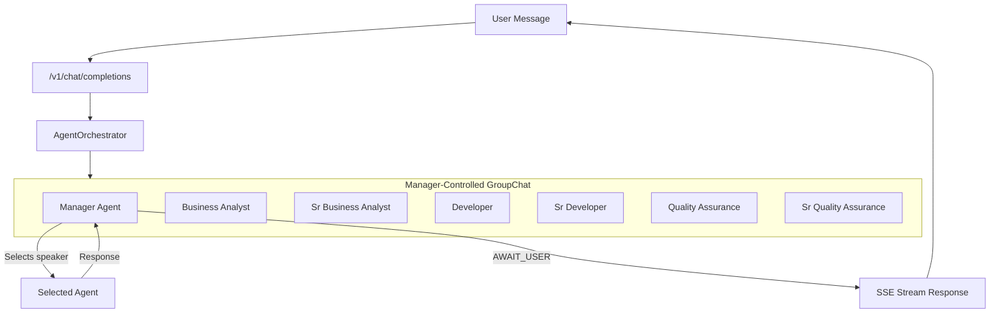
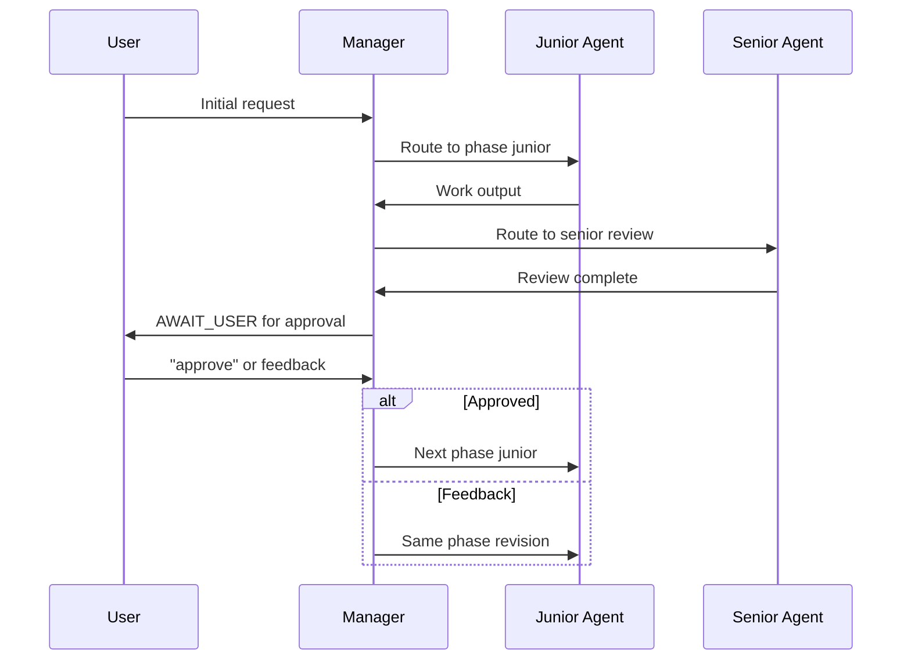
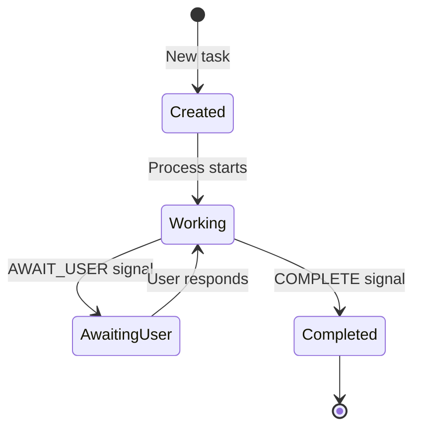

# StellarAnvil

StellarAnvil is an AI-powered SDLC (Software Development Life Cycle) orchestration platform built as a .NET 10 modular monolith. It provides OpenAI-compatible APIs for seamless integration with development tools like Cursor, Void, Cline, and Continue, while orchestrating full software development workflows using AI agents.

## Features

- **OpenAI-Compatible API**: Full compatibility with OpenAI API endpoints (`/v1/chat/completions`, `/v1/models`)
- **Manager-Controlled Workflows**: Dynamic SDLC orchestration using Microsoft.Agents.AI.Workflows
- **Junior/Senior Deliberation**: Each phase includes junior work + senior review pattern
- **Approval Gates**: User must explicitly approve before phase transitions
- **Streaming Responses**: Real-time SSE streaming for chat completions
- **Clean Architecture**: Domain-driven design with clear layer separation

## Architecture

StellarAnvil uses a **Manager-controlled GroupChat** pattern where an LLM-based Manager Agent dynamically decides which specialized agent should speak next.



### Deliberation Workflow

Within each phase, work follows a Junior → Senior deliberation pattern with user approval gates between phases:



### Task State Machine



### Project Structure

```
StellarAnvil.Api/
├── Domain/                    # Core business entities (no dependencies)
│   ├── Entities/
│   │   └── AgentTask.cs
│   └── Interfaces/
│       ├── ITaskRepository.cs
│       └── IAgentRegistry.cs
│
├── Application/               # Use cases and orchestration
│   ├── DTOs/
│   │   ├── ChatCompletionRequest.cs
│   │   ├── ChatCompletionChunk.cs
│   │   └── ModelsResponse.cs
│   ├── Results/
│   │   ├── DeliberationResult.cs
│   │   └── WorkflowBuildResult.cs
│   └── UseCases/
│       ├── IAgentOrchestrator.cs
│       └── AgentOrchestrator.cs
│
├── Infrastructure/            # External implementations
│   ├── Persistence/
│   │   └── InMemoryTaskRepository.cs
│   ├── AI/
│   │   ├── AgentFactory.cs
│   │   ├── AgentRegistry.cs
│   │   ├── DeliberationWorkflow.cs
│   │   └── ManagerGroupChatManager.cs
│   └── Helpers/
│       ├── TaskIdHelper.cs
│       └── ToolConverter.cs
│
└── Program.cs                 # Composition root
```

## Technology Stack

- **.NET 10**: Latest .NET framework
- **Microsoft.Agents.AI.Workflows**: Agent orchestration framework
- **Microsoft.Extensions.AI**: AI abstractions and chat client
- **OpenAI SDK**: LLM integration
- **SSE (Server-Sent Events)**: Real-time streaming responses

## Prerequisites

- [.NET 10 SDK](https://dotnet.microsoft.com/download/dotnet/10.0)
- [Git](https://git-scm.com/)
- OpenAI API key (or compatible endpoint)

## Quick Start

### 1. Clone the Repository

```bash
git clone https://github.com/yourusername/StellarAnvil.ai.git
cd StellarAnvil.ai
```

### 2. Configure AI Services

Add your AI API keys to `src/StellarAnvil.Api/appsettings.Development.json`:

```json
{
  "AI": {
    "OpenAI": {
      "ApiKey": "your-openai-api-key"
    }
  }
}
```

### 3. Run the API

```bash
cd src/StellarAnvil.Api
dotnet run
```

The API will start at `https://localhost:5001` (or the configured port).

## API Documentation

### OpenAI-Compatible Endpoints

| Endpoint | Method | Description |
|----------|--------|-------------|
| `/v1/chat/completions` | POST | Create streaming chat completion |
| `/v1/models` | GET | List available models |

### Example: Chat Completion

```bash
curl -X POST "https://localhost:5001/v1/chat/completions" \
  -H "Content-Type: application/json" \
  -d '{
    "model": "gpt-5-nano",
    "stream": true,
    "messages": [
      {
        "role": "user",
        "content": "Help me implement a login feature"
      }
    ]
  }'
```

**Note**: Only streaming requests are supported (`stream: true` is required).

## Conversation Continuity

StellarAnvil maintains conversation state across multiple requests using task IDs embedded in responses:

```html
<!-- task:abc123-def456 -->
```

When this marker is present in conversation history, the system automatically resumes the existing task rather than creating a new one. This enables multi-turn workflows where users can:
- Provide feedback on agent output
- Approve phases to proceed (`approve`, `lgtm`, `looks good`)
- Request revisions within the current phase

## Agent Roles

StellarAnvil includes 6 specialized agents organized in Junior/Senior pairs:

| Phase | Junior Agent | Senior Agent |
|-------|--------------|--------------|
| Business Analysis | `business-analyst` | `sr-business-analyst` |
| Development | `developer` | `sr-developer` |
| Quality Assurance | `quality-assurance` | `sr-quality-assurance` |

The **Manager Agent** orchestrates these agents, deciding:
- Which phase to start based on user intent
- When to route from Junior to Senior for review
- When to pause for user approval (`AWAIT_USER`)
- When the workflow is complete (`COMPLETE`)

## Development

### Running Tests

```bash
dotnet test
```

### Running with Watch

```bash
cd src/StellarAnvil.Api
dotnet watch run
```

## Contributing

1. Fork the repository
2. Create a feature branch: `git checkout -b feature/amazing-feature`
3. Commit your changes: `git commit -m 'Add amazing feature'`
4. Push to the branch: `git push origin feature/amazing-feature`
5. Open a Pull Request

## License

This project is licensed under the MIT License - see the [LICENSE](LICENSE) file for details.

## Acknowledgments

- [Microsoft.Extensions.AI](https://github.com/dotnet/extensions)
- [Microsoft Agent Framework](https://github.com/microsoft/agent-framework)
- [Continue.dev](https://continue.dev/) for inspiration on AI development tools
- [OpenAI](https://openai.com/) for API compatibility standards
